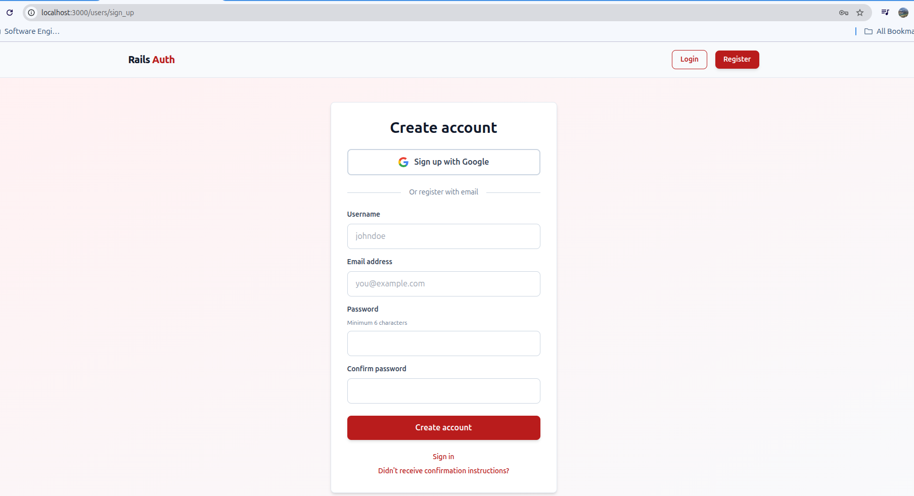
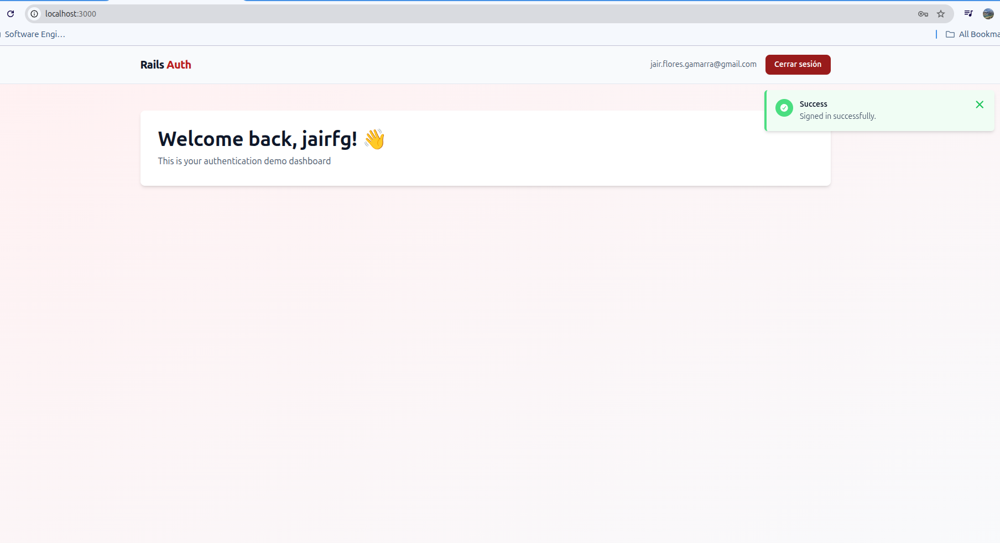

# 🚂 Ruby on Rails Authentication Boilerplate

Complete authentication system with Ruby on Rails, Devise, and Google OAuth integration.

## 📋 Description

This is a production-ready authentication boilerplate for Ruby on Rails applications. It includes user registration, login with email/username, password recovery, email confirmation via SendGrid, and Google OAuth integration.

## 🛠️ Tech Stack

- **Ruby** 3.3.5
- **Rails** 7.2.2.1
- **PostgreSQL** - Database
- **Devise** - Authentication
- **OmniAuth** - OAuth integration
- **ViewComponent** - Component-based views
- **Stimulus** - JavaScript framework
- **Tailwind CSS** - Styling
- **Docker** - Containerization

## 📦 Installation

### Prerequisites

- Docker and Docker Compose
- Git

### Setup

1. **Clone the repository**
```bash
git clone https://github.com/jairfg/Rails-Auth.git
cd Rails-Auth
```

2. **Configure environment variables**
```bash
# Create .env file
cp .env.example .env

# Edit .env and add your credentials
GOOGLE_CLIENT_ID=your_google_client_id
GOOGLE_CLIENT_SECRET=your_google_client_secret
SENDGRID_API_KEY=your_sendgrid_api_key
```

3. **Build and start Docker containers**
```bash
docker compose build
docker compose up
```

4. **Setup database**
```bash
docker compose run --rm web rails db:create
docker compose run --rm web rails db:migrate
```

5. **Access the application**
```
http://localhost:3000
```

## 🔧 Configuration

### Google OAuth Setup

1. Go to [Google Cloud Console](https://console.cloud.google.com/)
2. Create a new project
3. Enable Google+ API
4. Create OAuth 2.0 credentials
5. Add authorized redirect URI:
```
   http://localhost:3000/users/auth/google_oauth2/callback
```
6. Copy Client ID and Client Secret to `.env`

### SendGrid Setup

1. Sign up at [SendGrid](https://sendgrid.com/)
2. Create an API Key
3. Add to `.env`:
```
   SENDGRID_API_KEY=your_api_key
```
4. Configure sender email in `config/environments/development.rb`

## 📸 Screenshots

### Login Page


### Registration Page


### Home


---